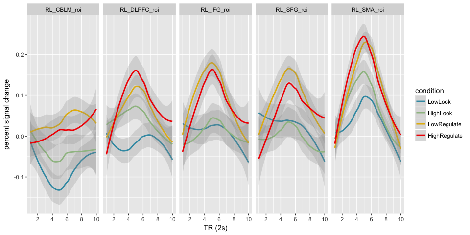
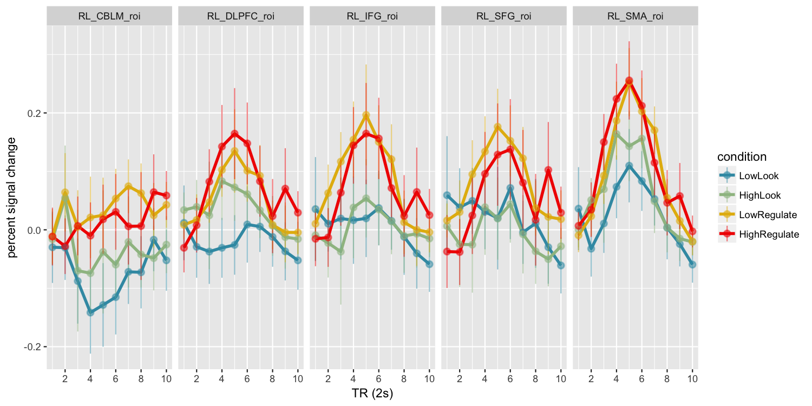

-   [load packages](#load-packages)
-   [load data](#load-data)
-   [plot data](#plot-data)

load packages
=============

    library(tidyverse)
    library(wesanderson)

load data
=========

    data = read.csv('/Volumes/psych-cog/dsnlab/FP/BDX_univariate/timecourses/timecourses.csv')

plot data
=========

    # set colot palette
    palette = wes_palette("Zissou", 4, type = "continuous")

    # filter out conditions of no interest and rearrange factor levels for plotting
    plot.data = data %>%
      filter(condition %in% c("HighLook", "HighRegulate", "LowLook", "LowRegulate")) %>%
      mutate(condition = factor(condition, levels = c("LowLook", "HighLook", "LowRegulate", "HighRegulate")))
      
    # plot data with LOESS curves
    ggplot(plot.data, aes(tr, percentChange, color = condition)) +
      geom_smooth(alpha = .25) + 
      facet_grid(~roi) +
      scale_color_manual(values=palette) + 
      labs(x = "TR (2s)", y = "percent signal change")+ 
      scale_x_continuous(breaks = seq(0,10,2))

    # plot means and CIs
    ggplot(plot.data, aes(tr, percentChange, color = condition)) +
      stat_summary(fun.y = mean, geom = "line", size = 1.25) + 
      stat_summary(fun.data = mean_cl_normal, geom = "pointrange", alpha = .5) +
      facet_grid(~roi) +
      scale_color_manual(values=palette) + 
      labs(x = "TR (2s)", y = "percent signal change")+ 
      scale_x_continuous(breaks = seq(0,10,2))

