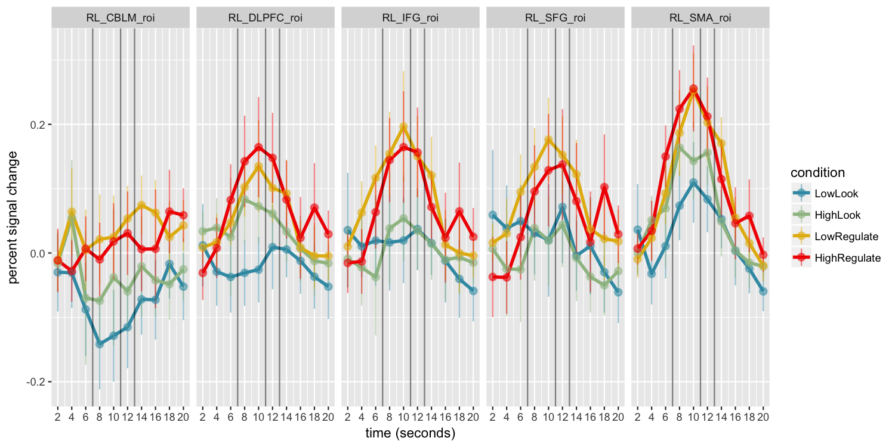

-   [load packages](#load-packages)
-   [load data](#load-data)
-   [tidy data for plotting](#tidy-data-for-plotting)
-   [plot data with LOESS curves](#plot-data-with-loess-curves)
    -   [All conditions](#all-conditions)
-   [plot data with LOESS curves by
    action](#plot-data-with-loess-curves-by-action)
    -   [By action](#by-action)
-   [plot means and CIs](#plot-means-and-cis)
    -   [All conditions](#all-conditions-1)
    -   [By action](#by-action-1)

load packages
=============

    library(tidyverse)
    library(wesanderson)

load data
=========

    data = read.csv('/Volumes/psych-cog/dsnlab/FP/BDX_univariate/timecourses/timecourses.csv')

tidy data for plotting
======================

    # set colot palette
    palette = wes_palette("Zissou", 4, type = "continuous")

    # filter out conditions of no interest and rearrange factor levels for plotting
    plot.data = data %>%
      filter(condition %in% c("HighLook", "HighRegulate", "LowLook", "LowRegulate")) 

    # add additional information 
    plot.data = plot.data %>%
      mutate(condition = factor(condition, levels = c("LowLook", "HighLook", "LowRegulate", "HighRegulate")),
             autonomy = ifelse(condition %in% c("LowLook", "LowRegulate"), "low", "high"),
             action = ifelse(condition %in% c("LowLook", "HighLook"), "look", "regulate"),
             seconds = tr*2)

plot data with LOESS curves
===========================

All conditions
--------------

Lines = rating, report, fixation

    ggplot(plot.data, aes(seconds, percentChange, color = condition)) +
      geom_smooth(alpha = .25) + 
      geom_vline(xintercept = c(7, 11, 13), alpha = .5) + 
      facet_grid(~roi) +
      scale_color_manual(values=palette) + 
      labs(x = "time (seconds)", y = "percent signal change")+ 
      scale_x_continuous(breaks = seq(0,20,2))

plot data with LOESS curves by action
=====================================

By action
---------

Lines = rating, report, fixation

    ggplot(plot.data, aes(seconds, percentChange, color = condition)) +
      geom_smooth(alpha = .25) + 
      geom_vline(xintercept = c(7, 11, 13), alpha = .5) + 
      facet_grid(action ~ roi) +
      scale_color_manual(values=palette) + 
      labs(x = "time (seconds)", y = "percent signal change") + 
      scale_x_continuous(breaks = seq(0,20,2))

plot means and CIs
==================

All conditions
--------------

Lines = rating, report, fixation

    ggplot(plot.data, aes(seconds, percentChange, color = condition)) +
      stat_summary(fun.y = mean, geom = "line", size = 1.25) + 
      stat_summary(fun.data = mean_cl_normal, geom = "pointrange", alpha = .5) +
      geom_vline(xintercept = c(7, 11, 13), alpha = .5) + 
      facet_grid(~roi) +
      scale_color_manual(values=palette) + 
      labs(x = "time (seconds)", y = "percent signal change") + 
      scale_x_continuous(breaks = seq(0,20,2))

By action
---------

Lines = rating, report, fixation

    ggplot(plot.data, aes(seconds, percentChange, color = condition)) +
      stat_summary(fun.y = mean, geom = "line", size = 1.25) + 
      stat_summary(fun.data = mean_cl_normal, geom = "pointrange", alpha = .5) +
      geom_vline(xintercept = c(7, 11, 13), alpha = .5) + 
      facet_grid(action ~ roi) +
      scale_color_manual(values=palette) + 
      labs(x = "time (seconds)", y = "percent signal change") + 
      scale_x_continuous(breaks = seq(0,20,2))

